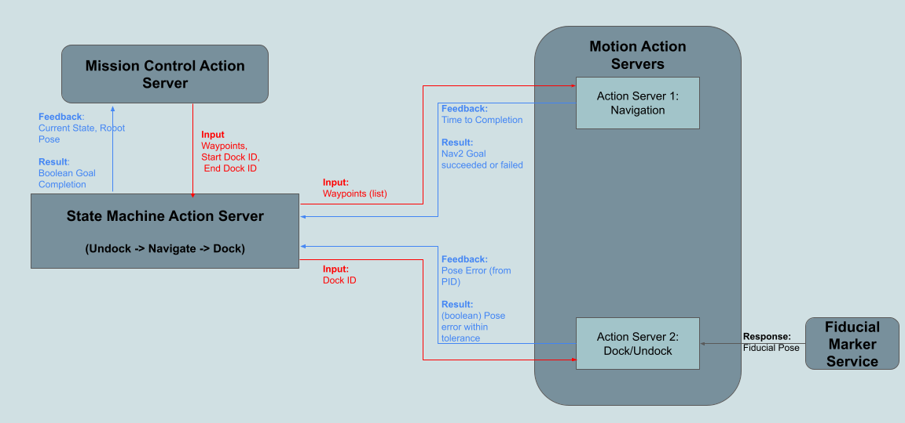

# Interfaces for Action Servers, Services and Offboard Communications

# Service Servers

The ```GetRobotPose.srv``` details the message types for the robot_pose_server.py which is
a service server to get localization pose

# Action Message Definitions

These are located in the action folder with ```.aciton``` files defining the messages for the
interfaces of all custom actions servers used on the robot

## High Level Logic

The action servers are part of the state machine on the robot which will call on each
action server independently


## Low Level Logic

Each action server communicates vital feedback or results which need to be propogated to
the top level nodes. This specific communication is shown below



# Launching Services

The service should also be launched when launching the action server (and must therefore
be included in the action server launch files, TBD)

Temporary measure to launch server
```bash
ros2 run robot_action_interfaces robot_pose_server.py
```
